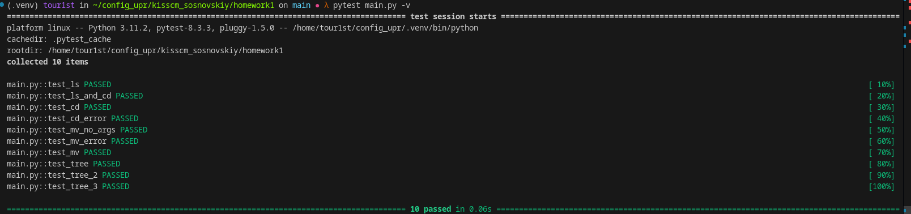

# Реализация эмулятора shell на языке программирования Python.
## Общее описание.
Программа написана на ЯП Python, сеанс в эмуляторе происходит в CLI режиме. Эмулятор поддерживает такие команды как: ls, cd, exit, tree, mv. Аргументами командной строки задаются такие параметры как: имя пользователя, имя компьютера, путь к архиву с файловой системой. Так же, с помощью аргумента --test, можно протестировать все команды эмулятора на тестовой файловой системе. Эмулятор поддерживает архивы только zip формата.
## Описание всех функций и настроек.
### ls
Выводит все директории и файлы, которые находятся в текущей директории.

### cd
Перемещает пользователя в директори, в качестве аргумента принимает имя директории, если команда была вызвана без агрументов, пользователь перемещается в корневую директорию. Так же специальными аргументами являются: ".." - перемещает пользователя на одну директорию выше, "-" - перемещает пользователя в прошлую директорию в которой он был.

### exit
Завершает работу эмулятора.

### tree
Выводит в консоль дерево всех директорий, которые находятся в текущей.

### mv
Перемещает файл/директорию. В качестве аргументов принимает путь к файлу/директории и путь, куда его нужно переместить.

## Сборка проекта.
```bash
git clone https://github.com/farblose/kisscm_sosnovskiy.git && \
cd kisscm_sosnovskiy/homework1 && \
python3 main.py [username] [pcname] [archive path]
```
## Запуск эмулятора в тестовом режиме
